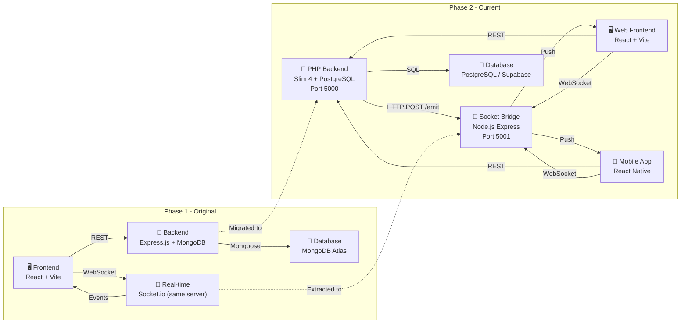
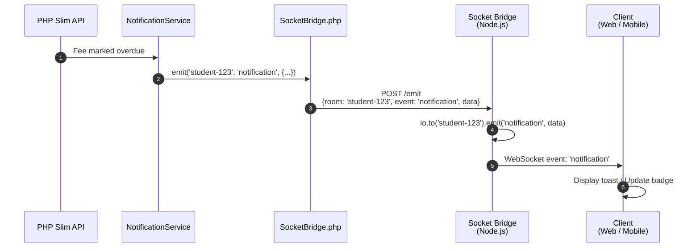
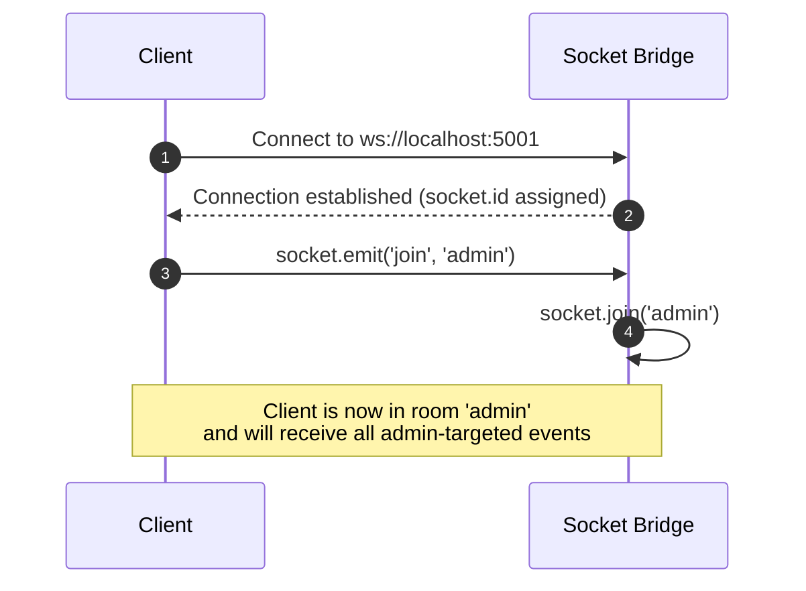
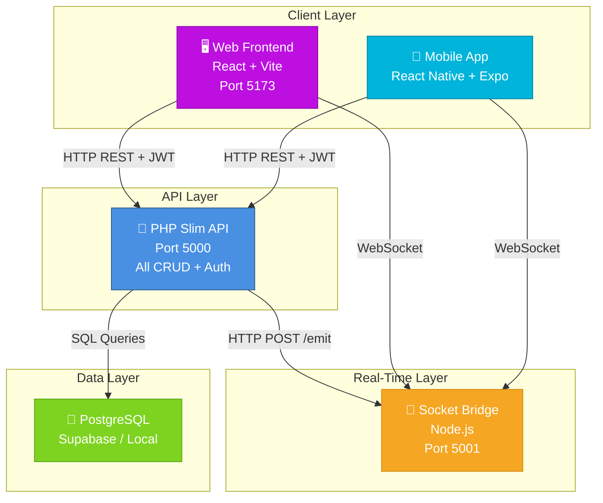

# Punjab Group of Colleges (PGC) — Original Backend & Socket Bridge System Design

> **Purpose**: This document explains the original Node.js/Express backend architecture, the migration decision to PHP, and the current role of the Node.js service as a real-time Socket Bridge. It provides complete context for viva presentation.

---

## 1. Overview

The project originally started with a **Node.js + Express + MongoDB** backend (the MERN approach). As the project evolved, the backend was **migrated to PHP (Slim 4 + PostgreSQL)** to better align with deployment requirements, hosting costs, and the supervisor's tech stack recommendations.

Today, the `backend/` folder houses only the **Socket.io Bridge** — a lightweight Node.js microservice that enables real-time notifications for both the web frontend and mobile app.

---

## 2. Architectural Evolution



### Why the Migration?

| Factor | Original (Node + Mongo) | Current (PHP + PostgreSQL) |
|--------|------------------------|---------------------------|
| **Hosting Cost** | MongoDB Atlas paid tier for production | PostgreSQL is cheaper / often free on shared hosting |
| **Supervisor Stack** | Supervisor preferred PHP stack | Aligns with academic requirements |
| **Relational Data** | CMS has heavy relationships (students↔courses↔teachers) | PostgreSQL handles relations natively with FK constraints |
| **ORM Familiarity** | Mongoose (Mongo) | Eloquent (Laravel) — widely taught |
| **Transactions** | MongoDB transactions are complex | PostgreSQL ACID transactions are straightforward |
| **File Uploads** | Multer (Node) | Native PHP file handling |
| **Real-time** | Socket.io embedded in Express | Socket.io as a separate bridge service |

---

## 3. Current Folder Structure (backend/)

```
backend/
├── .env                       # Environment variables (JWT_SECRET, etc.)
├── package.json               # Node dependencies (Express, Socket.io, CORS)
├── package-lock.json          # Locked versions
├── socket_bridge.js           # Main application: Socket.io Bridge microservice
└── uploads/                   # (Legacy) File upload directory
```

> **Note**: The original Express routes, Mongoose models, controllers, and middleware have been removed after successful migration to `backend-php/`. Only the Socket Bridge remains because Socket.io is a Node.js protocol and cannot run inside PHP.

---

## 4. Socket Bridge Deep Dive

### 4.1 What is it?

The **Socket Bridge** is a dedicated **Node.js microservice** (port 5001) that provides **WebSocket-based real-time messaging** to connected clients. PHP does not have a native Socket.io implementation, so this bridge acts as a translator:
- **PHP Backend** sends HTTP requests to the bridge.
- **Bridge** broadcasts those events via WebSocket to browsers and mobile apps.

### 4.2 Why a separate service?
- **Protocol Gap**: PHP is synchronous; WebSockets are persistent connections. Running Socket.io inside PHP would require external libraries with limited support.
- **Scalability**: The bridge can be scaled independently. If you have 10,000 concurrent users, you scale the bridge, not the PHP API.
- **Simplicity**: The bridge has only one job — accept HTTP events and emit WebSocket events. No database, no business logic.

### 4.3 Architecture

```mermaid
graph TB
    subgraph PHP Backend
        API["PHP Slim API<br/>Port 5000"]
        NOTIFY["NotificationService.php"]
        SB["SocketBridge.php<br/>Guzzle HTTP client"]
    end

    subgraph Bridge Service
        NODE["Node.js Express<br/>Port 5001"]
        HTTP["HTTP Endpoint<br/>POST /emit"]
        WS["Socket.io Server"]
    end

    subgraph Clients
        WEB["🖥️ Web Browser"]
        MOB["📱 Mobile App"]
    end

    API -->|Business Event| NOTIFY
    NOTIFY -->|HTTP POST| SB
    SB -->|{room, event, data}| HTTP
    HTTP -->|Validate| NODE
    NODE -->|io.to(room).emit()| WS
    WS -->|WebSocket| WEB
    WS -->|WebSocket| MOB

    style NODE fill:#7ED321,stroke:#5BA318,color:#fff
    style API fill:#4A90E2,stroke:#2E5C8A,color:#fff
    style WEB fill:#F5A623,stroke:#D68910,color:#fff
    style MOB fill:#BD10E0,stroke:#8B0AA8,color:#fff
```

### 4.4 Code Structure

```javascript
// socket_bridge.js
import express from "express";
import { createServer } from "http";
import { Server } from "socket.io";
import cors from "cors";

const app = express();
const PORT = process.env.SOCKET_PORT || 5001;

// CORS for all origins (dev). Restrict in production.
app.use(cors({ origin: "*" }));
app.use(express.json());

const httpServer = createServer(app);
const io = new Server(httpServer, {
  cors: { origin: "*", methods: ["GET", "POST", "PUT", "DELETE"] },
});

// --- WebSocket Events ---
io.on("connection", (socket) => {
  console.log("Socket client connected:", socket.id);

  // Clients join rooms (e.g., 'admin', 'teacher', 'student', or specific user IDs)
  socket.on("join", (room) => {
    const normalizedRoom = String(room).toLowerCase().trim();
    socket.join(normalizedRoom);
    console.log(`Client ${socket.id} joined room: ${normalizedRoom}`);
  });

  socket.on("disconnect", () => {
    console.log("Socket client disconnected:", socket.id);
  });
});

// --- HTTP Endpoint for PHP Backend ---
app.post("/emit", (req, res) => {
  const { room, event, data } = req.body;
  if (!room || !event) {
    return res.status(400).json({ error: "Missing room or event" });
  }

  const normalizedRoom = String(room).toLowerCase().trim();
  io.to(normalizedRoom).emit(event, data);

  console.log(`[Bridge] Emitted "${event}" to room "${room}"`);
  return res.status(200).json({ success: true });
});

// Health check for monitoring
app.get("/health", (req, res) => {
  res.status(200).json({ status: "bridge healthy" });
});

httpServer.listen(PORT, () => {
  console.log(`Socket Bridge running on port ${PORT}`);
});
```

### 4.5 How PHP Emits Events

`backend-php/src/SocketBridge.php` uses **Guzzle** (PHP HTTP client) to POST to the bridge:

```php
class SocketBridge {
    public static function emit(string $room, string $event, array $data = []) {
        $client = new \GuzzleHttp\Client();
        $client->post('http://localhost:5001/emit', [
            'json' => [
                'room'  => $room,
                'event' => $event,
                'data'  => $data,
            ],
            'timeout' => 2,
        ]);
    }
}
```

This design means:
- The PHP backend **does not need to know WebSocket internals**.
- The bridge **does not need to know business logic**.
- They communicate via the universal language: **HTTP JSON**.

---

## 5. Data Flow Diagrams

### 5.1 PHP → Bridge → Client (Real-Time Notification)



### 5.2 Client Joins Room



---

## 6. Original Architecture (For Reference)

Before migration, the `backend/` folder contained a full Express.js application:

```
backend/ (Original Structure)
├── server.js                  # Express app, all routes, Socket.io server
├── package.json               # Express, Mongoose, Passport, JWT, Multer, Socket.io
├── .env                       # MONGO_URI, JWT_SECRET, PORT
├── uploads/                   # Multer file uploads
├── models/
│   └── index.js               # Mongoose schemas (User, Student, Teacher, Course, etc.)
├── routes/
│   ├── auth.js                # Login, register, Google OAuth, JWT
│   └── data.js                # CRUD endpoints for all collections
└── middleware/
    ├── auth.js                # JWT verification middleware
    └── passport.js            # Google OAuth strategy
```

### Original Tech Stack
- **Runtime**: Node.js 18+
- **Framework**: Express.js 4.x
- **Database**: MongoDB (Atlas for cloud, local for dev)
- **ODM**: Mongoose
- **Auth**: Passport.js (Google OAuth) + jsonwebtoken (JWT)
- **Real-time**: Socket.io (embedded in Express server)
- **File Uploads**: Multer
- **Validation**: Manual + Zod (via frontend)

### Why it was replaced
- MongoDB's document model worked well for prototyping but became complex when handling relational queries (students enrolled in courses, teachers assigned to departments, attendance records linking students and courses).
- PostgreSQL's relational model with foreign keys, joins, and ACID transactions was a better fit for a CMS with strict data integrity requirements.
- Supervisor preference for PHP stack.

---

## 7. Security Architecture

### 7.1 Socket Bridge Security
- **CORS**: Currently set to `origin: "*"` for development. In production, this must be restricted to the frontend domain.
- **No Authentication**: The `/emit` endpoint does not require auth. In production, this should be protected with:
  - **IP Whitelisting**: Only the PHP backend server can reach port 5001.
  - **API Key**: A shared secret between PHP and the bridge.
- **Room Normalization**: Room names are lowercased and trimmed to prevent case-sensitivity bugs.

### 7.2 WebSocket Client Security
- Clients authenticate via the **same JWT** used for REST API calls.
- The WebSocket connection itself does not carry the token (Socket.io can be configured to send it in the handshake query if needed).
- All sensitive actions are still validated by the PHP backend via REST; Socket.io is only for **notifications**, never for data mutations.

---

## 8. Deployment Guide

### Prerequisites
- Node.js 18+

### Development
```bash
cd backend
npm install
node socket_bridge.js
```

Server starts on port 5001 by default.

### Production
```bash
node socket_bridge.js        # Or use PM2 for process management
pm2 start socket_bridge.js --name "socket-bridge"
```

### Environment Variables
Create `.env`:
```env
SOCKET_PORT=5001
```

### Firewall / Network
- Port 5001 should be **blocked from public internet** if not needed externally.
- Only the PHP backend (localhost or internal network) should reach `/emit`.
- Port 5001 for WebSocket should be **open to clients** (browsers/mobile) if they connect directly.

---

## 9. Integration with the Full System



---

## 10. Summary for Viva

- **What was the original backend?** A full Node.js + Express + MongoDB application with embedded Socket.io.
- **What is it now?** A dedicated **Socket.io Bridge** microservice running on Node.js port 5001.
- **Why the change?** The main backend migrated to PHP (Slim 4 + PostgreSQL) for relational data integrity, hosting costs, and supervisor alignment. Socket.io remains in Node.js because PHP cannot natively run persistent WebSocket servers.
- **How does the bridge work?** PHP sends an HTTP POST with `{room, event, data}` to `localhost:5001/emit`. The bridge broadcasts via WebSocket to all clients in that room.
- **What are the rooms?** Rooms are role-based (`admin`, `teacher`, `student`) or user-specific (`student-123`, `teacher-456`). Clients `join` a room on connection.
- **Security?** CORS restricted in production, `/emit` endpoint should be IP-whitelisted, WebSocket is notification-only (no data mutations).
- **Deployment?** `node socket_bridge.js` or PM2 for production. Port 5001 for WebSocket clients, internal-only for `/emit`.
