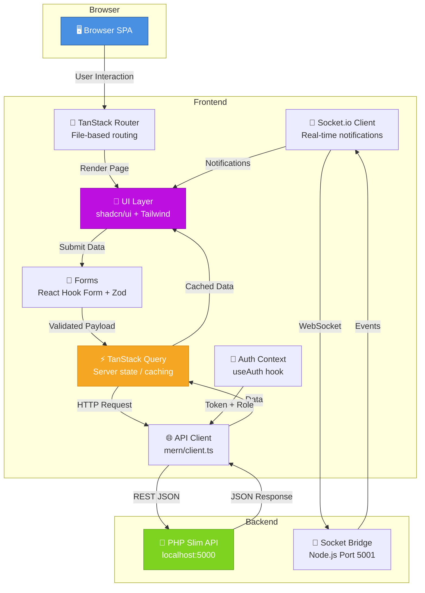
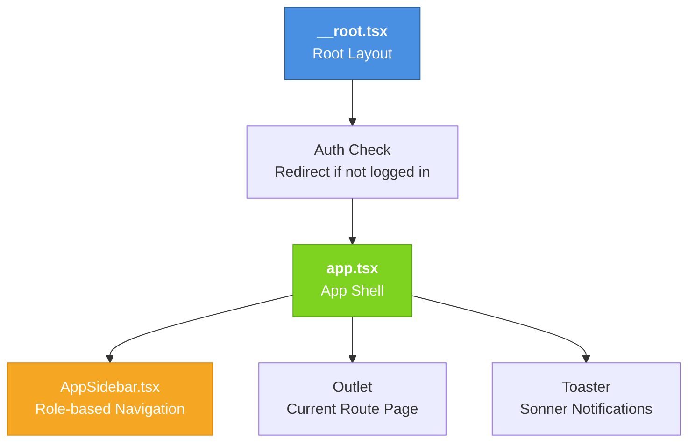
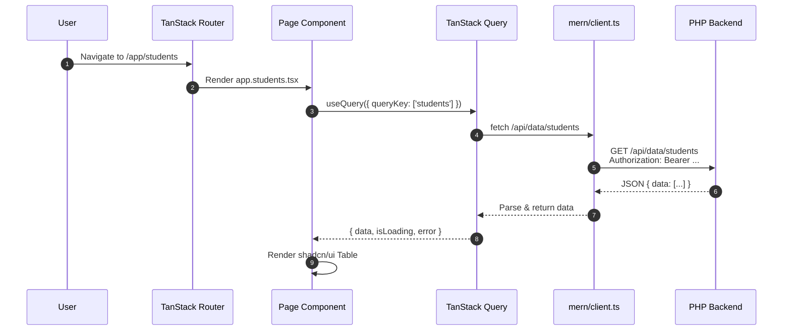
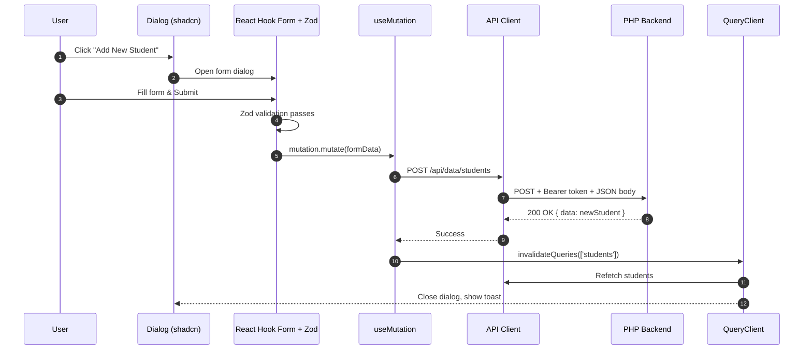
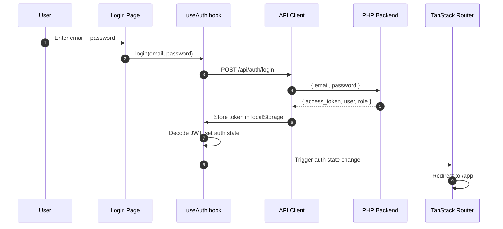
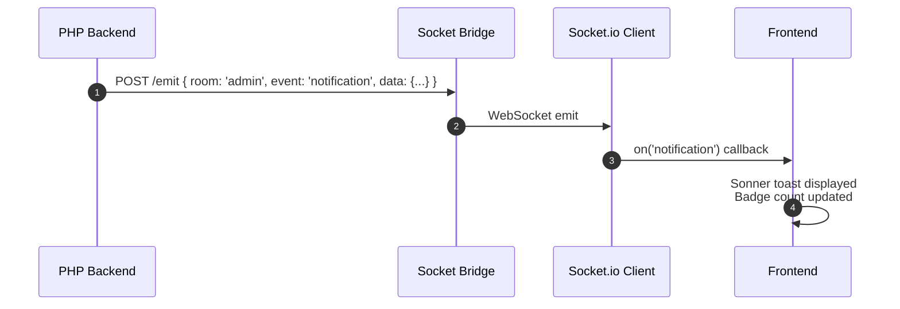

# Punjab Group of Colleges (PGC) — Web Frontend System Design

> **Purpose**: This document provides a complete, viva-ready explanation of the web frontend for the College Management System (CMS). It covers architecture, folder structure, routing, state management, component hierarchy, data flow, UML diagrams, and deployment.

---

## 1. Overview

The web frontend is the **administrative dashboard** and primary user interface of the CMS. It is a **Single Page Application (SPA)** built with modern React tooling. It communicates exclusively with the **PHP Slim backend API** (port 5000) over HTTP REST and receives real-time notifications via WebSocket (port 5001).

### Who uses it?
- **Admin**: Full CRUD access — students, teachers, courses, departments, fees, complaints, timetables, FYP, attendance.
- **Teacher**: View-only access to their courses, students, timetable, and the ability to mark attendance.
- **Student**: View their courses, attendance, fees, timetable, FYP progress, and submit complaints.

### Why this stack?
- **React 19**: Latest React with concurrent features, automatic batching, and better performance.
- **TypeScript**: Compile-time type safety, better IDE support, fewer runtime bugs.
- **Vite**: Ultra-fast dev server, tree-shaking, and optimized production builds.
- **TanStack Router**: Type-safe file-based routing with automatic route generation.
- **TanStack Query**: Powerful server-state management — caching, refetching, background updates.
- **Tailwind CSS v4**: Utility-first CSS for rapid, consistent styling without writing custom CSS files.
- **shadcn/ui + Radix**: Accessible, composable UI primitives (dialogs, tables, forms, dropdowns) with zero runtime CSS-in-JS overhead.

---

## 2. High-Level Architecture



### Communication Flow
1. User navigates to a route (e.g., `/app/students`).
2. TanStack Router resolves the file-based route and renders the matching page component.
3. The page component (e.g., `StudentsManager`) triggers a TanStack Query `useQuery` to fetch data.
4. The API client (`mern/client.ts`) constructs an HTTP request with the JWT `Bearer` token.
5. The PHP backend validates the token, queries PostgreSQL, and returns JSON.
6. TanStack Query caches the response and invalidates stale data automatically.
7. If a real-time event arrives via Socket.io, a toast notification appears instantly.

---

## 3. Folder Structure

```
frontend/
├── public/                    # Static assets (favicon, images)
├── dist/                      # Production build output (Vite)
│
├── index.html                 # HTML entry point (loads Vite bundle)
├── vite.config.ts             # Vite configuration (plugins, aliases, Tailwind)
├── tsconfig.json              # TypeScript compiler options
├── package.json               # Dependencies (React, TanStack, Tailwind, shadcn)
├── .env                       # Environment variables (VITE_API_URL)
│
├── src/
│   ├── main.tsx               # React root render + QueryClient + Router
│   ├── router.tsx             # Router instance configuration
│   ├── routeTree.gen.ts       # Auto-generated route tree (TanStack Router)
│   ├── styles.css             # Global styles + Tailwind directives + custom CSS
│   │
│   ├── routes/                # File-based route pages (each file = one route)
│   │   ├── __root.tsx         # Root layout (applies to ALL routes)
│   │   ├── index.tsx          # Landing / Home page (marketing/public)
│   │   ├── login.tsx          # Login page
│   │   ├── register.tsx       # Registration page
│   │   ├── app.tsx            # Main app shell (sidebar + outlet for nested routes)
│   │   ├── app.index.tsx      # Admin dashboard (stats, charts, quick actions)
│   │   ├── app.students.tsx   # Students management page
│   │   ├── app.teachers.tsx   # Teachers management page
│   │   ├── app.courses.tsx    # Courses management page
│   │   ├── app.departments.tsx # Departments management page
│   │   ├── app.attendance.tsx # Attendance marking & history
│   │   ├── app.timetable.tsx  # Weekly timetable view & editor
│   │   ├── app.fees.tsx       # Fee records & payment tracking
│   │   ├── app.fyp.tsx        # Final Year Project portal
│   │   ├── app.complaints.tsx # Complaints inbox & resolution
│   │   └── app.settings.tsx  # Profile & password settings
│   │
│   ├── components/            # Reusable business logic components
│   │   ├── AppSidebar.tsx     # Left navigation sidebar with role-based links
│   │   ├── StudentsManager.tsx   # Full CRUD table for students
│   │   ├── TeachersManager.tsx   # Full CRUD table for teachers
│   │   ├── CoursesManager.tsx    # Full CRUD table for courses
│   │   └── ui/                # shadcn/ui primitive components (50+ files)
│   │       ├── button.tsx
│   │       ├── table.tsx
│   │       ├── dialog.tsx
│   │       ├── form.tsx
│   │       ├── input.tsx
│   │       ├── select.tsx
│   │       ├── badge.tsx
│   │       ├── card.tsx
│   │       ├── tabs.tsx
│   │       └── ... (and many more)
│   │
│   ├── hooks/                 # Custom React hooks
│   │   ├── use-auth.ts        # Authentication state, login, logout, role detection
│   │   ├── use-mobile.tsx     # Responsive breakpoint detection
│   │   └── use-theme.ts       # Dark/light/system theme management
│   │
│   ├── integrations/          # Third-party service adapters
│   │   └── mern/
│   │       └── client.ts      # API client: fetch wrapper, JWT auth, Supabase-like query builder
│   │
│   └── lib/                   # Utility functions
│       └── utils.ts           # cn() helper (clsx + tailwind-merge)
```

---

## 4. Routing Architecture (TanStack Router)

TanStack Router uses a **file-based convention**. The file path inside `src/routes/` determines the URL.

| File Path | URL Route | Purpose |
|-----------|-----------|---------|
| `index.tsx` | `/` | Public landing page |
| `login.tsx` | `/login` | Authentication page |
| `register.tsx` | `/register` | Account creation |
| `app.tsx` | `/app` | Authenticated shell (sidebar + content area) |
| `app.index.tsx` | `/app/` | Dashboard (default child of `/app`) |
| `app.students.tsx` | `/app/students` | Student management |
| `app.teachers.tsx` | `/app/teachers` | Teacher management |
| `app.courses.tsx` | `/app/courses` | Course catalog |
| `app.departments.tsx` | `/app/departments` | Departments |
| `app.attendance.tsx` | `/app/attendance` | Attendance module |
| `app.timetable.tsx` | `/app/timetable` | Timetable scheduler |
| `app.fees.tsx` | `/app/fees` | Fee management |
| `app.fyp.tsx` | `/app/fyp` | FYP portal |
| `app.complaints.tsx` | `/app/complaints` | Complaints |
| `app.settings.tsx` | `/app/settings` | User settings |

### Route Guards
- The `__root.tsx` layout wraps every route. It checks authentication state.
- If the user is not logged in, they are redirected to `/login`.
- If the user is logged in and visits `/login`, they are redirected to `/app`.
- Inside `/app/*`, `AppSidebar.tsx` renders navigation links based on the user's role.

---

## 5. State Management

### 5.1 Server State: TanStack Query

All data that comes from the backend is managed by **TanStack Query** (formerly React Query). This is a superior alternative to Redux for server data because it handles:
- **Caching**: Data is cached by query key. Revisiting a page does not re-fetch unless stale.
- **Background Refetching**: When the window regains focus, data silently refreshes in the background.
- **Optimistic Updates**: UI updates immediately before the server confirms.
- **Error Retries**: Automatic retry with exponential backoff on network errors.

Example pattern in a Manager component:
```typescript
const { data, isLoading } = useQuery({
  queryKey: ['students'],
  queryFn: () => mern.from('students').then(r => r.data),
});

const mutation = useMutation({
  mutationFn: (newStudent) => mern.from('students').insert(newStudent),
  onSuccess: () => queryClient.invalidateQueries({ queryKey: ['students'] }),
});
```

### 5.2 Client State: React Hooks

Local UI state (dialog open/close, form values, search filters) is managed with:
- `useState` for simple toggles and inputs.
- `useReducer` for complex multi-field forms.
- `React Hook Form` + `Zod` for validated forms (add/edit dialogs).

### 5.3 Authentication State: `use-auth.ts`

A custom hook that:
- Reads the JWT token from `localStorage` (key: `mock_session`).
- Decodes the token to extract user ID, email, and role.
- Provides `login()`, `logout()`, `changePassword()` methods.
- Emits auth state changes to all subscribers (used by router guards).

---

## 6. Component Hierarchy

### 6.1 Layout Components



### 6.2 Manager Components Pattern

Every data entity follows the same **Manager Pattern**:

```
┌─────────────────────────────────────────────┐
│  StudentsManager.tsx (or Teachers, Courses) │
├─────────────────────────────────────────────┤
│  1. Data Table (shadcn/ui Table)            │
│     - Columns: ID, Name, Email, Actions     │
│     - Sorting & Pagination                  │
├─────────────────────────────────────────────┤
│  2. Search & Filter Bar                     │
│     - SearchInput (by name/email)           │
│     - Select (filter by department)         │
├─────────────────────────────────────────────┤
│  3. Action Buttons                          │
│     - "Add New" → opens Dialog             │
│     - Export / Refresh                      │
├─────────────────────────────────────────────┤
│  4. Add/Edit Dialog                         │
│     - React Hook Form + Zod validation      │
│     - POST (create) or PUT (update)         │
├─────────────────────────────────────────────┤
│  5. Delete Confirmation                     │
│     - AlertDialog → DELETE request          │
└─────────────────────────────────────────────┘
```

### 6.3 UI Primitive Layer (shadcn/ui)

All visual components are built on top of **Radix UI primitives** (headless, accessible) and styled with **Tailwind CSS**.

| Primitive | Usage in CMS |
|-----------|-------------|
| `Dialog` | Add/Edit forms, detail views |
| `Table` | All data grids (students, teachers, fees) |
| `Form` | Form wrappers with validation error display |
| `Input` | Text fields (name, email, roll number) |
| `Select` | Dropdowns (department, degree, semester) |
| `Badge` | Status indicators (Paid, Pending, Overdue) |
| `Card` | Dashboard stats, info panels |
| `Tabs` | Switching between views (list vs. chart) |
| `AlertDialog` | Delete confirmations |
| `Toast` | Success/error notifications (Sonner) |
| `Calendar` | Date pickers for attendance, fees |
| `Popover` | Quick actions, filters |

---

## 7. API Client: `mern/client.ts`

The frontend uses a **custom fetch-based API client** that mimics a Supabase-style interface for historical compatibility while talking to the PHP backend.

### Key Features
- **Base URL**: Reads from `VITE_API_URL` env variable (defaults to `http://localhost:5000`).
- **Auth Headers**: Automatically attaches `Authorization: Bearer <token>` from localStorage.
- **Query Builder Pattern**: Chainable `.from().eq().order().limit()` syntax.
- **CRUD Operations**:
  - `.insert(data)` → POST
  - `.update(data)` → PUT (with query params)
  - `.delete()` → DELETE (with query params)
  - `.eq().order().limit()` → GET (with query params)

### Why a custom client instead of Axios?
- The project was originally designed for a Supabase-like backend. The custom client preserves the same API surface, making the frontend backend-agnostic.
- Native `fetch` is dependency-free and works everywhere.

---

## 8. Page-by-Page Breakdown

### 8.1 Login Page (`login.tsx`)
- **Layout**: Centered card with logo.
- **Fields**: Email, Password.
- **Flow**: `mern.auth.signInWithPassword()` → save session to localStorage → redirect to `/app`.
- **Validation**: Zod schema ensures valid email format and minimum password length.

### 8.2 Dashboard (`app.index.tsx`)
- **Stats Cards**: Total Students, Teachers, Courses, Departments, Pending Fees, Unresolved Complaints.
- **Charts**: Recharts bar/line charts for enrollment trends and fee collection.
- **Recent Activity**: Latest registrations, complaints, and FYP submissions.
- **Quick Actions**: Buttons to jump to common tasks (Add Student, Mark Attendance).

### 8.3 Students Page (`app.students.tsx`)
- **Component**: `StudentsManager.tsx`
- **Features**: Full CRUD, department filter, search by name/roll number/email, image upload preview.

### 8.4 Teachers Page (`app.teachers.tsx`)
- **Component**: `TeachersManager.tsx`
- **Features**: CRUD, course assignment display, qualification badges.

### 8.5 Courses Page (`app.courses.tsx`)
- **Component**: `CoursesManager.tsx`
- **Features**: Course code badge, credit hours, semester, linked teacher, enrolled student count.

### 8.6 Attendance Page (`app.attendance.tsx`)
- **Teacher View**: Select course + date → FlatList of students with toggle switches (Present/Absent/Late).
- **Admin View**: Filter by course, date, or student. View attendance percentage.
- **Student View**: Read-only attendance history with percentage progress bar.

### 8.7 Timetable Page (`app.timetable.tsx`)
- **Grid View**: Weekly grid (Mon–Sat, time slots). Each cell shows course, teacher, room.
- **Conflict Detection**: Warns if a room or teacher is double-booked.
- **Role-based**: Admins can edit; teachers/students see read-only filtered views.

### 8.8 Fees Page (`app.fees.tsx`)
- **Status Badges**: Green (Paid), Amber (Pending), Red (Overdue).
- **Filter Tabs**: All / Paid / Pending / Overdue.
- **Actions**: Record payment, generate invoice, send reminder.
- **Charts**: Monthly fee collection trends.

### 8.9 FYP Portal (`app.fyp.tsx`)
- **Admin View**: Approve/reject FYP groups, view submissions, assign grades.
- **Teacher View**: Supervised groups list, grade submissions.
- **Student View**: Group info, upload PDF submissions, view grades.

### 8.10 Complaints Page (`app.complaints.tsx`)
- **Admin View**: Inbox with status badges, reply dialog, mark as resolved.
- **Student View**: Submit new complaint form, track status.

### 8.11 Settings Page (`app.settings.tsx`)
- **Profile**: View/edit name, email.
- **Password**: Change password with old password verification.
- **Theme**: Toggle light/dark/system mode.
- **Sign Out**: Clear session and redirect to login.

---

## 9. Data Flow Diagrams

### 9.1 Page Load & Data Fetch



### 9.2 Create Record Flow



### 9.3 Authentication Flow



### 9.4 Real-Time Notification Flow



---

## 10. Security Considerations

### 10.1 Authentication
- **JWT Storage**: Token is stored in `localStorage`. While not ideal for XSS-prone apps, React's auto-escaping mitigates most XSS vectors.
- **Token Expiry**: 7-day expiration enforced by the backend. Frontend cannot bypass this.
- **Route Guards**: Unauthenticated users cannot access `/app/*` routes.

### 10.2 Input Validation
- **Zod Schemas**: Every form has a Zod schema that validates before any API call.
- **Server-Side Validation**: The PHP backend re-validates everything independently.

### 10.3 XSS Prevention
- **React Auto-Escaping**: All JSX content is automatically escaped. No `dangerouslySetInnerHTML` is used.
- **Safe File URLs**: Uploaded file URLs are validated before display.

### 10.4 CSRF Protection
- **Stateless API**: Since we use JWT in headers (not cookies), traditional CSRF attacks are not applicable.

---

## 11. Performance Optimizations

| Technique | Implementation | Benefit |
|-----------|----------------|---------|
| **Code Splitting** | Vite automatic chunking | Smaller initial bundle |
| **Route-Based Lazy Loading** | TanStack Router lazy imports | Only load code for visited routes |
| **Data Caching** | TanStack Query stale-while-revalidate | No redundant network requests |
| **Memoization** | `useMemo`, `useCallback` | Prevent unnecessary re-renders |
| **Virtualization** | (Future) `react-window` for large tables | Render only visible rows |
| **Image Optimization** | `expo-image` equivalents on web | Lazy load images |
| **Tree Shaking** | Vite esbuild | Dead code elimination |

---

## 12. Deployment Guide

### Prerequisites
- Node.js 18+
- The PHP backend running on `localhost:5000`

### Development
```bash
cd frontend
npm install        # or bun install
npm run dev        # Starts Vite dev server on localhost:5173
```

### Production Build
```bash
npm run build      # Outputs to dist/
```

The `dist/` folder contains static HTML, JS, and CSS. Deploy it to:
- **Vercel / Netlify**: Drag-and-drop `dist/` folder.
- **Nginx**: Copy `dist/` contents to `/var/www/html`.
- **Apache**: Serve `dist/` as document root. Enable `mod_rewrite` for SPA routing.

### Environment Variables
Create `.env`:
```env
VITE_API_URL=http://localhost:5000
```

---

## 13. Summary for Viva

- **What is it?** A React-based Single Page Application (SPA) dashboard for the College Management System.
- **Stack?** React 19 + TypeScript + Vite + TanStack Router + TanStack Query + Tailwind CSS + shadcn/ui.
- **Architecture?** File-based routing, server-state via TanStack Query, client-state via React hooks.
- **Auth?** JWT stored in localStorage, decoded to get role, route guards redirect unauthenticated users.
- **Data Fetching?** Custom fetch client (`mern/client.ts`) with chainable query builder, automatic auth headers.
- **UI?** Built entirely from shadcn/ui primitives (Radix + Tailwind) — consistent, accessible, zero CSS-in-JS runtime.
- **Real-time?** Socket.io client listens to Node bridge for push notifications (toasts, badge updates).
- **Forms?** React Hook Form + Zod for validation, shadcn/ui Form/Input/Select/Dialog components.
