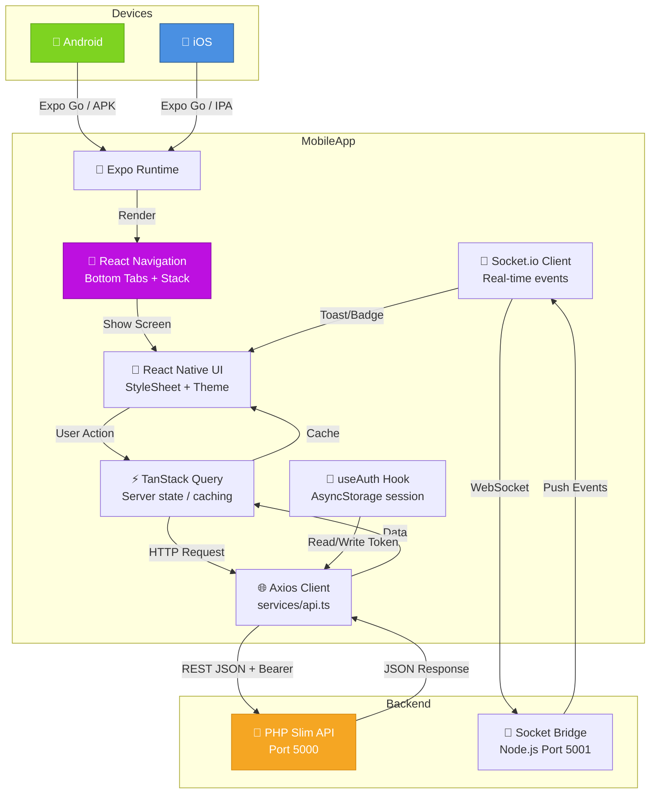
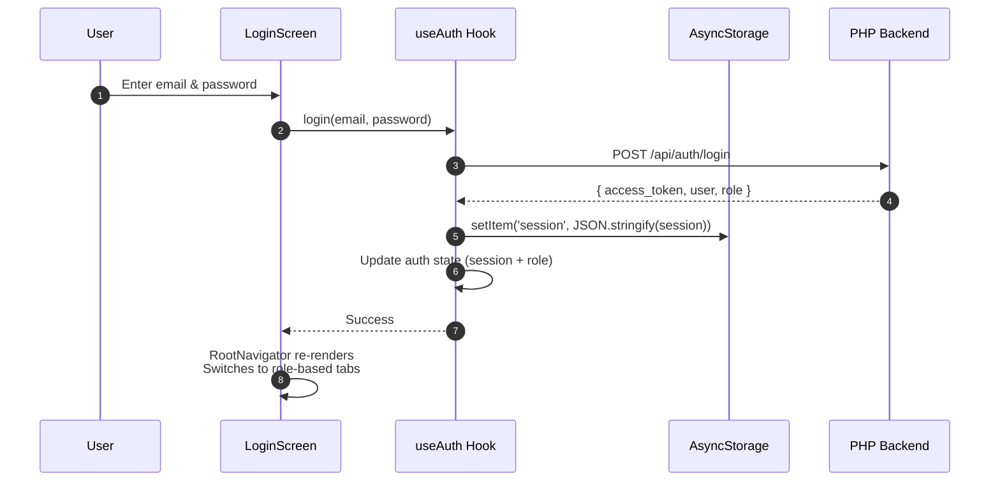
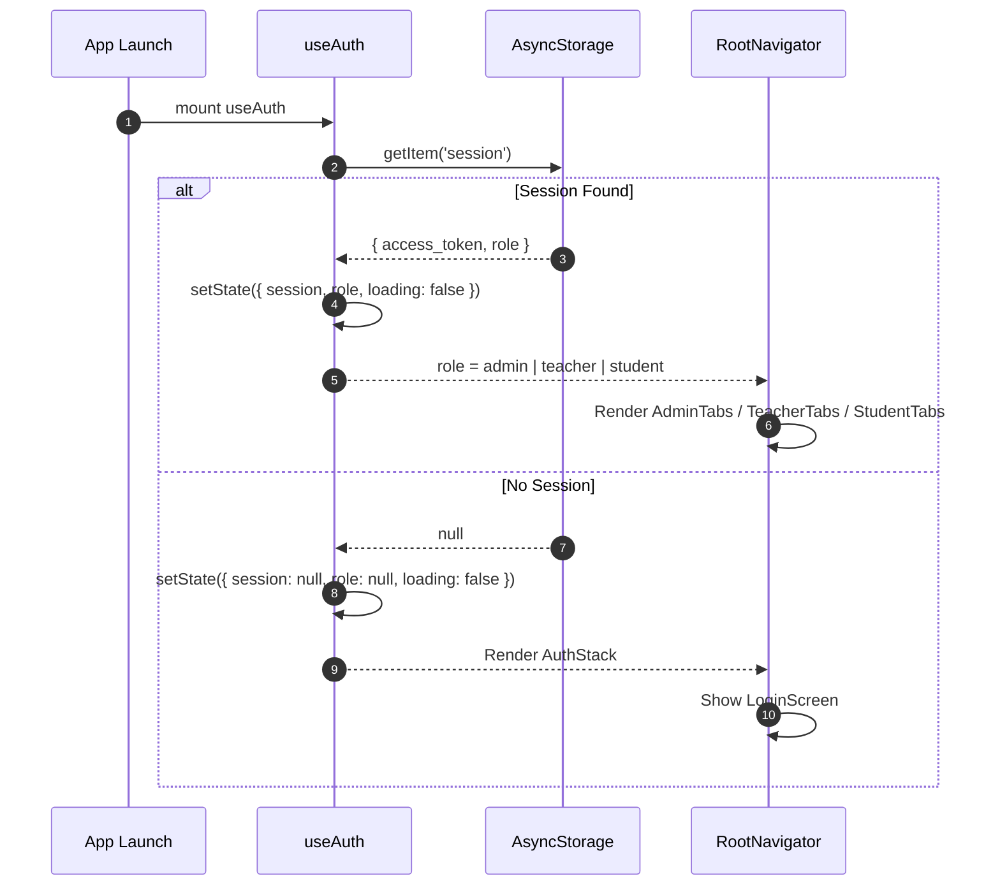
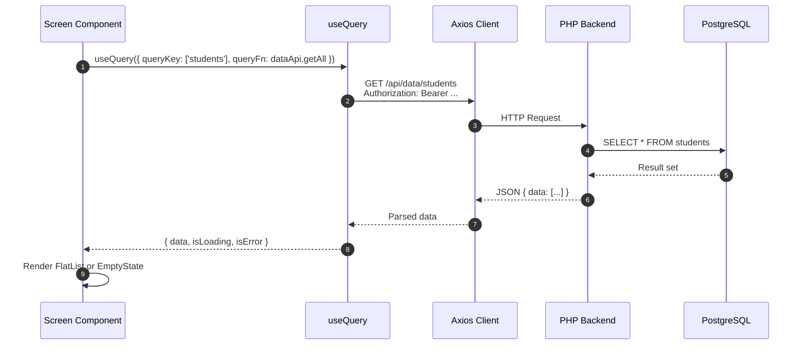
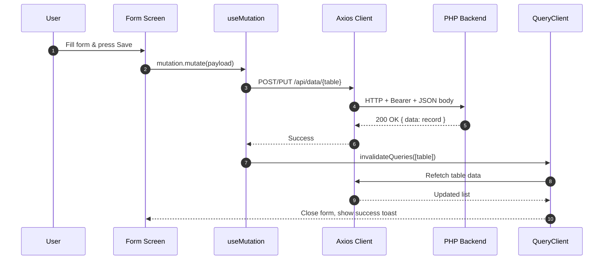
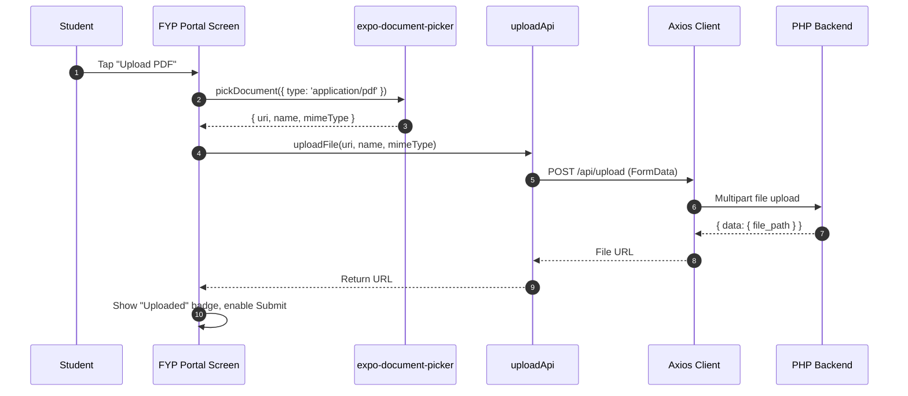

# Punjab Group of Colleges (PGC) — Mobile App System Design

> **Purpose**: This document provides a complete, viva-ready explanation of the mobile application for the College Management System (CMS). It covers architecture, folder structure, navigation, screen hierarchy, API integration, data flow, UML diagrams, and deployment.

---

## 1. Overview

The mobile app brings the College Management System to **Android and iOS devices**. It shares the **same PHP backend API** as the web frontend, ensuring a single source of truth for all data. The app is built with **React Native** and managed by **Expo**, which simplifies development, testing, and deployment without requiring native Android Studio or Xcode setup.

### Who uses it?
- **Admin**: Manage the college on the go — view dashboards, approve FYP groups, resolve complaints, check fee status.
- **Teacher**: Mark attendance directly from the classroom, view today's timetable, manage FYP groups.
- **Student**: Check timetable, view attendance percentage, see fee status, submit complaints, upload FYP documents.

### Why this stack?
- **React Native**: Write once in JavaScript/TypeScript, run on both Android and iOS. Huge community, massive library ecosystem.
- **Expo**: Handles the native build toolchain. Provides easy OTA updates, push notifications, and device APIs (camera, document picker, file system).
- **React Navigation**: Industry-standard navigation for React Native. Supports stacks, tabs, and drawers.
- **TanStack Query**: Same server-state library used in the web frontend. Shared mental model, shared caching logic.
- **Axios**: Familiar HTTP client with request/response interceptors (perfect for attaching auth tokens).
- **Lucide React Native**: Consistent iconography matching the web frontend.

---

## 2. High-Level Architecture



### Communication Flow
1. User opens the app. Expo loads the JavaScript bundle.
2. `useAuth` checks AsyncStorage for an existing session (JWT token + role).
3. If a session exists, `RootNavigator` renders the correct role-based tab navigator (Admin, Teacher, or Student).
4. Each screen uses `useQuery` to fetch data via Axios from the PHP backend.
5. The Axios interceptor automatically injects the `Authorization: Bearer <token>` header.
6. Data is cached by TanStack Query. Pull-to-refresh triggers a manual refetch.
7. Socket.io client connects to the Node bridge and listens for push notifications.

---

## 3. Folder Structure

```
MobileApp/
├── app.json                   # Expo configuration (name, icon, splash, permissions)
├── package.json               # Dependencies (Expo, React Native, Navigation, Axios)
├── tsconfig.json              # TypeScript paths & strictness
├── assets/                    # App icon, splash screen images, fonts
│
├── src/
│   ├── app/                   # Expo Router entry files (minimal / unused in this project)
│   │   ├── _layout.tsx
│   │   ├── index.tsx
│   │   └── explore.tsx
│   │
│   ├── navigation/            # All navigators (React Navigation)
│   │   ├── RootNavigator.tsx  # Top-level switch: Auth vs. Role-Based Tabs
│   │   ├── AuthStack.tsx      # Login screen stack (minimal)
│   │   ├── AdminTabs.tsx      # Admin bottom tab bar configuration
│   │   ├── TeacherTabs.tsx    # Teacher bottom tab bar configuration
│   │   ├── StudentTabs.tsx    # Student bottom tab bar configuration
│   │   └── CustomTabs.tsx     # Shared tab bar UI component (icons, labels, styling)
│   │
│   ├── screens/               # All screen components organized by role
│   │   ├── auth/
│   │   │   └── LoginScreen.tsx    # Email + Password login
│   │   ├── admin/
│   │   │   ├── DashboardScreen.tsx    # Stats cards, recent activity
│   │   │   ├── StudentsScreen.tsx     # Student list + add/edit
│   │   │   ├── TeachersScreen.tsx     # Teacher list + add/edit
│   │   │   ├── CoursesScreen.tsx      # Course catalog
│   │   │   └── DepartmentsScreen.tsx  # Department management
│   │   ├── teacher/
│   │   │   ├── DashboardScreen.tsx    # My courses, today's schedule
│   │   │   ├── MyCoursesScreen.tsx    # Read-only course list
│   │   │   ├── AttendanceScreen.tsx  # Mark attendance by course/date
│   │   │   └── FypScreen.tsx        # Supervised FYP groups
│   │   ├── student/
│   │   │   ├── DashboardScreen.tsx    # My stats, today's classes
│   │   │   ├── MyCoursesScreen.tsx    # Enrolled courses
│   │   │   └── AttendanceScreen.tsx  # Personal attendance history
│   │   └── shared/
│   │       ├── TimetableScreen.tsx    # Weekly schedule (all roles)
│   │       ├── FeesScreen.tsx         # Fee status & history
│   │       ├── ComplaintsScreen.tsx   # Submit / resolve complaints
│   │       ├── FypPortalScreen.tsx   # FYP groups & submissions
│   │       ├── SettingsScreen.tsx    # Profile, password, theme, logout
│   │       └── NotificationsScreen.tsx # In-app notification inbox
│   │
│   ├── components/            # Reusable UI components
│   │   ├── StatCard.tsx       # Dashboard stat card (number + label + icon)
│   │   ├── Badge.tsx          # Status badge (Paid, Pending, Overdue, Present, Absent)
│   │   ├── Card.tsx           # Container card with shadow
│   │   ├── SearchBar.tsx      # Styled TextInput with search icon
│   │   ├── FormInput.tsx      # Labeled text input with validation error
│   │   ├── FormPicker.tsx     # Labeled dropdown using React Native picker
│   │   ├── EmptyState.tsx     # Illustration + message for empty lists
│   │   ├── LoadingSpinner.tsx # Centered ActivityIndicator
│   │   ├── ErrorView.tsx      # Retry button + error message
│   │   ├── Header.tsx         # Screen header with title & optional actions
│   │   └── ListItem.tsx       # Row item for FlatLists (student, teacher, course)
│   │
│   ├── hooks/                 # Custom React hooks
│   │   ├── useAuth.tsx        # Session state, login, logout, role detection
│   │   ├── use-theme.ts       # Theme-aware colors & styles
│   │   ├── use-color-scheme.ts       # System dark/light mode (native)
│   │   └── use-color-scheme.web.ts   # Web-specific color scheme hook
│   │
│   ├── services/              # API & external service wrappers
│   │   └── api.ts             # Axios instance + auth interceptors + API methods
│   │
│   ├── theme/                 # Design system constants
│   │   ├── colors.ts          # Primary, accent, success, warning, background, text colors
│   │   └── typography.ts      # Font sizes, weights, line heights
│   │
│   ├── constants/             # App-wide constants
│   │   └── api.ts             # API URL, timeout values, table names
│   │
│   └── lib/                   # Utility functions
│       └── utils.ts           # cn() helper, date formatters, validators
│
└── scripts/
    └── reset-project.js       # Expo utility to reset project state
```

---

## 4. Navigation Architecture

The app uses **React Navigation** with a **nested navigator** pattern. The root decides the entire navigation tree based on authentication state.

```mermaid
graph TD
    ROOT["RootNavigator.tsx"]
    AUTH["AuthStack<br/>LoginScreen"]
    ADMIN["AdminTabs"]
    TEACHER["TeacherTabs"]
    STUDENT["StudentTabs"]

    ROOT -->|No Session| AUTH
    ROOT -->|Role = admin| ADMIN
    ROOT -->|Role = teacher| TEACHER
    ROOT -->|Role = student| STUDENT

    subgraph Admin Navigation
        AD_HOME["🏠 Home<br/>(Dashboard)"]
        AD_ACAD["🎓 Academics<br/>(Stack: Students, Teachers, Courses, Departments)"]
        AD_OPS["⚙️ Operations<br/>(Stack: Attendance, Timetable, Fees, FYP, Complaints)"]
        AD_PROF["👤 Profile<br/>(Settings)"]
        ADMIN --> AD_HOME
        ADMIN --> AD_ACAD
        ADMIN --> AD_OPS
        ADMIN --> AD_PROF
    end

    subgraph Teacher Navigation
        T_HOME["🏠 Home<br/>(Dashboard)"]
        T_ACAD["🎓 Academics<br/>(Stack: My Courses, My Students)"]
        T_OPS["⚙️ Operations<br/>(Stack: Attendance, Timetable, FYP, Complaints)"]
        T_PROF["👤 Profile<br/>(Settings)"]
        TEACHER --> T_HOME
        TEACHER --> T_ACAD
        TEACHER --> T_OPS
        TEACHER --> T_PROF
    end

    subgraph Student Navigation
        S_HOME["🏠 Home<br/>(Dashboard)"]
        S_ACAD["🎓 Academics<br/>(Stack: My Courses, Timetable, Attendance)"]
        S_OPS["⚙️ Operations<br/>(Stack: Fees, FYP, Complaints)"]
        S_PROF["👤 Profile<br/>(Settings)"]
        STUDENT --> S_HOME
        STUDENT --> S_ACAD
        STUDENT --> S_OPS
        STUDENT --> S_PROF
    end
```



### RootNavigator Logic
```typescript
function RootNavigator() {
  const { session, role, loading } = useAuth();

  if (loading) return <ActivityIndicator />;  // Splash loading state
  if (!session) return <AuthStack />;           // Not logged in

  switch (role) {
    case 'admin':   return <AdminTabs />;
    case 'teacher': return <TeacherTabs />;
    case 'student': return <StudentTabs />;
    default:        return <AuthStack />;
  }
}
```

### Bottom Tab Configuration
Each role has a **Bottom Tab Navigator** with 4 tabs:
- **Home**: Dashboard with stats relevant to the role.
- **Academics**: Academic-related screens in a nested Stack Navigator.
- **Operations**: Administrative/operational screens in a nested Stack Navigator.
- **Profile**: Settings, password change, and sign out.

The `CustomTabs.tsx` component styles the tab bar with:
- Active tab highlighted in **Primary Blue (`#2563EB`)**.
- Inactive tabs in **Text Muted (`#64748B`)**.
- Lucide icons for each tab.

---

## 5. Authentication Flow

### 5.1 Login Process



### 5.2 Session Persistence
- On app launch, `useAuth` reads `session` from **AsyncStorage**.
- If found, it validates the token structure and sets the authenticated state.
- If the token is expired, the backend returns 401 on the first API call, and the user is redirected to login.
- Logout removes the `session` key from AsyncStorage and resets the auth state.

### 5.3 Axios Interceptors
Every API request automatically includes the token:
```typescript
api.interceptors.request.use(async (config) => {
  const raw = await AsyncStorage.getItem('session');
  if (raw) {
    const session = JSON.parse(raw);
    if (session?.access_token) {
      config.headers.Authorization = `Bearer ${session.access_token}`;
    }
  }
  return config;
});
```

---

## 6. API Integration

### 6.1 Axios Client (`services/api.ts`)

A single Axios instance is configured with:
- **baseURL**: Points to the PHP backend (`http://<wifi-ip>:5000`).
- **timeout**: 15 seconds for regular requests, 60 seconds for file uploads.
- **headers**: `Content-Type: application/json` by default.
- **Request Interceptor**: Attaches JWT from AsyncStorage.
- **Response Interceptor**: Preserves server error messages for display in UI.

### 6.2 API Modules

The API is organized into modules for clarity:

| Module | Methods | Backend Endpoint |
|--------|---------|------------------|
| `authApi` | login, register, getSession, logout, changePassword | `/api/auth/*` |
| `dataApi` | getAll, getOne, create, update, remove | `/api/data/{table}` |
| `uploadApi` | uploadFile | `/api/upload` |

### 6.3 Dynamic CRUD Engine

Just like the web frontend, the mobile app uses a **dynamic table engine**:
```typescript
dataApi.getAll('students');              // GET /api/data/students
dataApi.getOne('students', id);         // GET /api/data/students?id=xxx
dataApi.create('students', payload);    // POST /api/data/students
dataApi.update('students', id, data); // PUT /api/data/students?id=xxx
dataApi.remove('students', id);         // DELETE /api/data/students?id=xxx
```

This same pattern works for all 14 tables without writing new endpoint code.

### 6.4 File Uploads

FYP submissions require PDF uploads. The app handles both native and web:
- **Native (Android/iOS)**: Uses React Native FormData with `{ uri, name, type }` object.
- **Web**: Fetches the blob from `expo-document-picker` blob URL, then appends as a native `Blob`.

---

## 7. Screen-by-Screen Breakdown

### 7.1 Auth Screens

| Screen | Key Widgets | API Connection |
|--------|-------------|----------------|
| **Login** | Logo, Email `TextInput`, Password `TextInput`, "Sign In" `Button` | `POST /api/auth/login` |
| **Splash** | Animated logo, loading spinner | `GET /api/auth/session` (via AsyncStorage) |

### 7.2 Admin Screens (11 screens)

| Screen | Widgets | API |
|--------|---------|-----|
| **Dashboard** | Stats cards (Total Students, Teachers, Courses, Complaints), Quick action FABs | `GET /api/dashboard/stats` |
| **Students List** | `SearchBar`, `FlatList` of student cards, FAB "+" | `GET /api/data/students` |
| **Student Add/Edit** | `TextInput` fields, `Picker` (department, degree, semester), image picker | `POST/PUT /api/data/students` |
| **Teachers List** | `SearchBar`, `FlatList`, FAB "+" | `GET /api/data/teachers` |
| **Teacher Add/Edit** | Form inputs, department picker | `POST/PUT /api/data/teachers` |
| **Courses** | Course cards, multi-select for teacher/student assignment | `GET/PUT /api/data/courses` |
| **Departments** | Department cards, Add/Edit modal | `GET/POST/PUT/DELETE /api/data/departments` |
| **Attendance** | `Picker` (course, date), student list with `Switch` toggles | `GET/POST /api/data/attendance` |
| **Timetable** | Day tabs (Mon–Sat), time slot cards, FAB "+" | `GET/POST/PUT/DELETE /api/data/timetables` |
| **Fees** | Fee cards with status badges, filter tabs | `GET/POST/PUT /api/data/fees` |
| **FYP Portal** | Group cards, Approve/Reject buttons, submissions list | `GET/PUT /api/data/fyp_groups` |
| **Complaints** | Inbox list with status badges, detail view with reply input | `GET/PUT /api/data/complaints` |
| **Settings** | Profile info, Change password, Sign out | `PUT /api/auth/update`, `POST /api/auth/logout` |

### 7.3 Teacher Screens (8 screens)

| Screen | Widgets | API |
|--------|---------|-----|
| **Dashboard** | Stats (My Courses, My Students, Pending Complaints, FYP Groups), today's schedule | Filtered by `teacher_id` |
| **My Courses** | Course cards, read-only | `GET /api/data/courses` (filtered) |
| **My Students** | `FlatList` grouped by course | `GET /api/data/students` (filtered) |
| **Attendance** | `Picker` (my courses, date), `Switch` toggles, Save | `GET/POST /api/data/attendance` |
| **Timetable** | Day tabs, my schedule cards | `GET /api/data/timetables` (filtered) |
| **FYP Groups** | Supervised group cards, grade input | `GET/PUT /api/data/fyp_groups` |
| **Complaints** | Complaints assigned to me, reply input | `GET/PUT /api/data/complaints` |
| **Settings** | Profile, password, sign out | Auth endpoints |

### 7.4 Student Screens (8 screens)

| Screen | Widgets | API |
|--------|---------|-----|
| **Dashboard** | Stats (Enrolled Courses, Attendance %, Fee Status, FYP Status), today's classes | Personal record lookups |
| **My Courses** | Enrolled course cards (code, name, teacher) | `GET /api/data/courses` (filtered) |
| **Timetable** | Day tabs, my class cards | `GET /api/data/timetables` (filtered) |
| **Attendance** | Course `Picker`, attendance history `FlatList`, % progress bar | `GET /api/data/attendance` (filtered) |
| **Fees** | Fee cards, payment history | `GET /api/data/fees` (filtered) |
| **FYP Progress** | Group info card, submissions list, upload PDF button | `GET/POST /api/data/fyp_submissions` |
| **Complaints** | My complaints list, "New Complaint" FAB, form, status tracking | `GET/POST /api/data/complaints` |
| **Settings** | Profile, password, sign out | Auth endpoints |

---

## 8. Data Flow Diagrams

### 8.1 App Launch & Auth Resolution



### 8.2 Screen Data Fetch



### 8.3 Create/Update Record



### 8.4 File Upload (FYP Submission)



---

## 9. Security Architecture

### 9.1 Authentication
- **Token Storage**: JWT stored in **AsyncStorage** (React Native's equivalent of localStorage). It is NOT stored in cookies, avoiding CSRF risks.
- **Token Attachment**: Every request automatically includes the `Authorization` header via Axios interceptors.
- **Token Expiry**: Backend enforces 7-day JWT expiry. The app handles 401 responses by redirecting to login.

### 9.2 Input Validation
- **Frontend**: Basic form validation (required fields, email format, numeric checks) before API calls.
- **Backend**: PHP backend re-validates all inputs with Zod-equivalent logic (length checks, required fields, foreign key existence).

### 9.3 Role-Based Access
- The app does not trust the client for access control. All authorization is enforced by the PHP backend.
- However, the UI adapts to the role to hide irrelevant screens and actions, improving UX.

### 9.4 Network Security
- API base URL should use HTTPS in production.
- File uploads validate MIME types server-side.
- No sensitive data is logged to the console in production builds.

---

## 10. Performance Optimizations

| Technique | Implementation | Benefit |
|-----------|----------------|---------|
| **TanStack Query Caching** | `useQuery` with `staleTime` | Avoid redundant API calls when revisiting screens |
| **Lazy Screen Loading** | `React.lazy()` for heavy screens | Faster initial app startup |
| **FlatList Virtualization** | Native `FlatList` | Only renders visible items, handles thousands of rows |
| **Image Caching** | `expo-image` / `Image` with cache keys | Reduced bandwidth for profile pictures |
| **Memoization** | `useMemo`, `React.memo` on cards | Prevents re-renders of static list items |
| **Optimistic Updates** | TanStack Query `optimisticData` | UI feels instant on mutations |

---

## 11. Cross-Platform Considerations

| Feature | Native (Android/iOS) | Web (Expo Web) |
|---------|---------------------|----------------|
| **File Upload** | FormData with `{uri, name, type}` object | Fetch blob from blob URL, then append |
| **Storage** | `AsyncStorage` | `AsyncStorage` (works on web too) |
| **Color Scheme** | `use-color-scheme.ts` | `use-color-scheme.web.ts` |
| **Navigation** | React Navigation native stacks | React Navigation web-compatible |
| **Icons** | `lucide-react-native` | `lucide-react-native` (renders SVG) |
| **Safe Area** | `react-native-safe-area-context` | CSS padding fallback |

---

## 12. Deployment Guide

### Prerequisites
- Node.js 18+
- Expo CLI: `npm install -g expo-cli`
- An Android/iOS device or emulator

### Development
```bash
cd MobileApp
npm install
npx expo start
```
Scan the QR code with **Expo Go** app (Android) or Camera app (iOS) to load the app.

### Configure Backend URL
Edit `src/services/api.ts`:
```typescript
const API_URL = 'http://YOUR_PC_WIFI_IP:5000';
```
The mobile device must be on the same WiFi network as the PHP backend server.

### Building Production Apps

**Android APK:**
```bash
eas build -p android --profile preview
```

**iOS IPA:**
```bash
eas build -p ios
```

*(Requires Apple Developer account for iOS)*

### OTA Updates (Expo)
Expo allows pushing JavaScript updates without app store review:
```bash
eas update --branch production --message "Bug fix v1.0.1"
```

---

## 13. Summary for Viva

- **What is it?** A cross-platform mobile app (Android + iOS) for the College Management System.
- **Stack?** React Native + Expo + TypeScript + React Navigation + TanStack Query + Axios.
- **Architecture?** Role-based bottom tab navigation with nested stack navigators. Root navigator switches entire UI tree based on auth role.
- **Auth?** JWT stored in AsyncStorage, attached to every request via Axios interceptor, 7-day expiry enforced by backend.
- **Data Fetching?** TanStack Query caches server state, Axios handles HTTP, same PHP backend as web frontend.
- **UI?** React Native StyleSheet with a custom theme system (colors, typography), Lucide icons, reusable card/badge/input components.
- **Real-time?** Socket.io client connects to Node bridge for push notifications.
- **File Uploads?** `expo-document-picker` for PDF selection, `FormData` for upload to PHP backend.
- **Deployment?** Expo Go for development, EAS Build for production APK/IPA, OTA updates for quick bug fixes.
