# College Management System - Complete UML Diagrams & Architecture

## Table of Contents
1. [System Architecture](#system-architecture)
2. [Database Schema (MongoDB)](#database-schema)
3. [Backend Architecture](#backend-architecture)
4. [Frontend Architecture](#frontend-architecture)
5. [User Roles & Relationships](#user-roles--relationships)
6. [Data Flow Diagrams](#data-flow-diagrams)
7. [API Routes](#api-routes)

---

## System Architecture

### Overall System Design

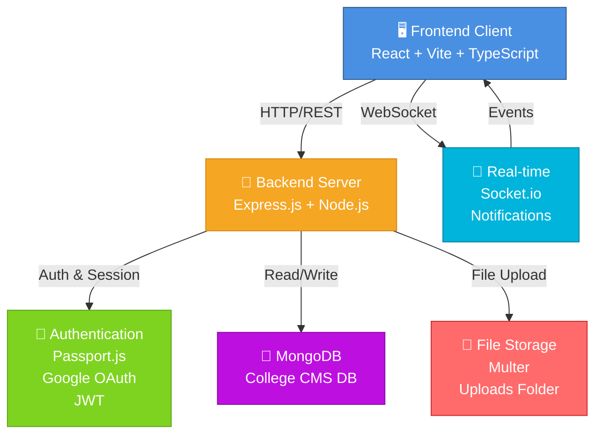

---

## Database Schema

### MongoDB Collections & Relationships

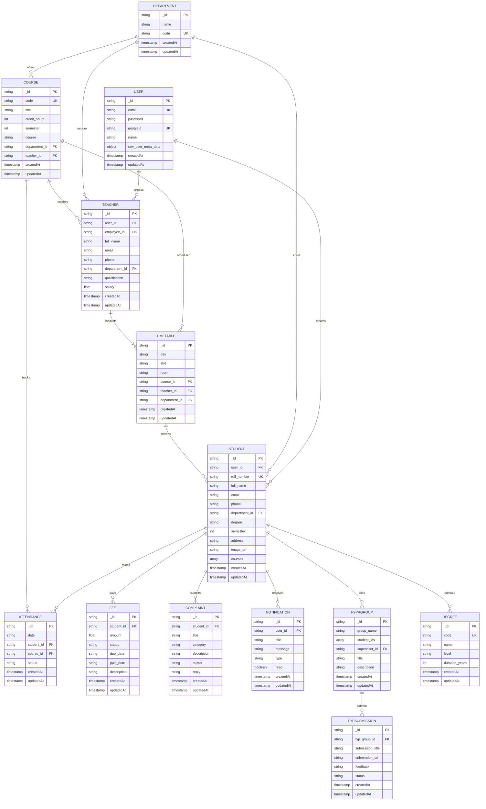

---

## Backend Architecture

### Backend Component Structure

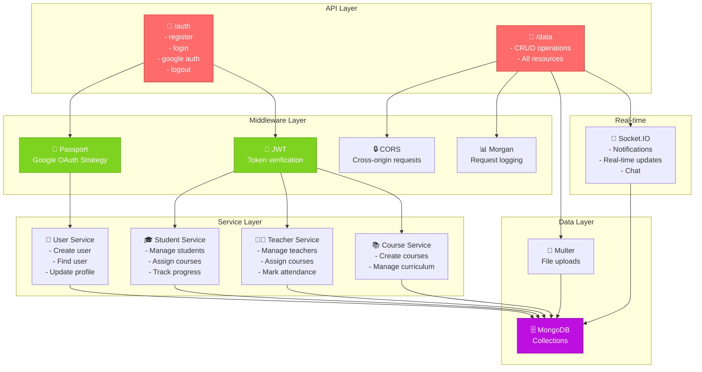

### Backend Request-Response Flow

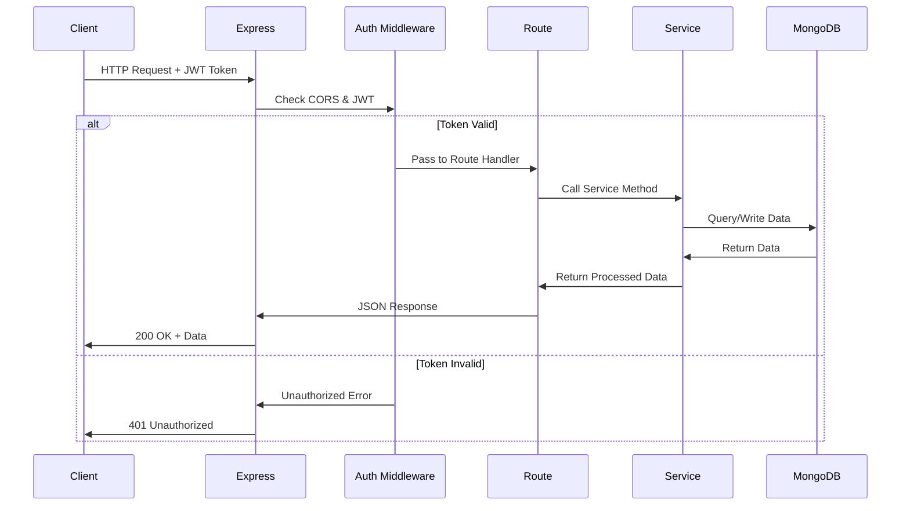

---

## Frontend Architecture

### Frontend Component Hierarchy

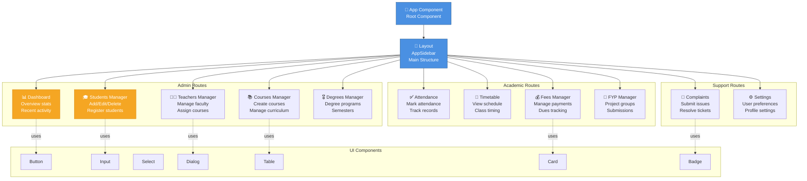

### Frontend Data Flow (React Query)

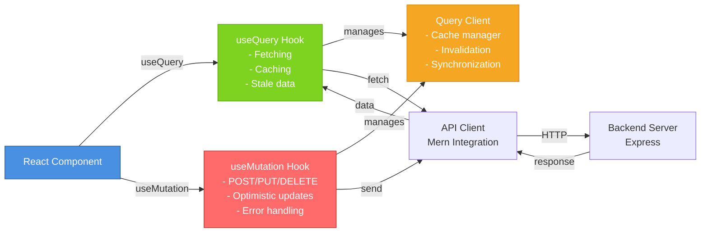

---

## User Roles & Relationships

### Role-Based Access Control (RBAC)

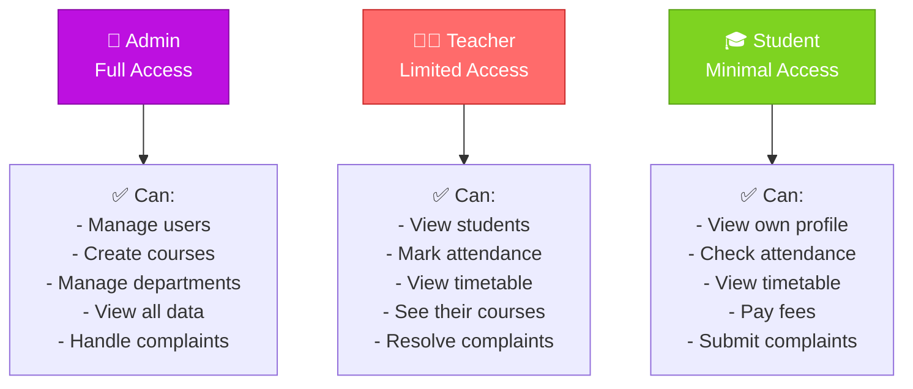

---

## Data Flow Diagrams

### Student Registration Flow

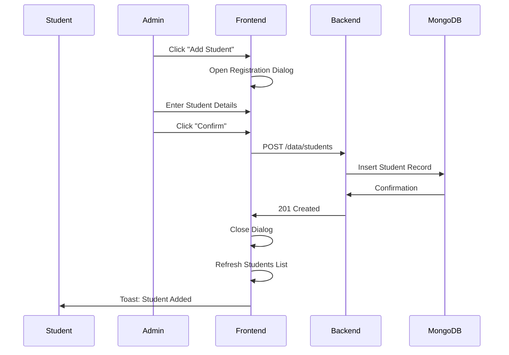

### Course Assignment Flow

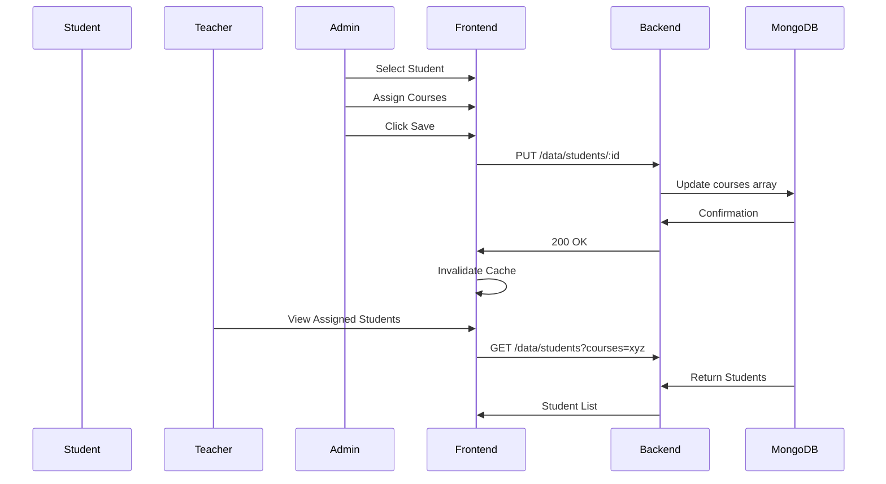

### Attendance Marking Flow

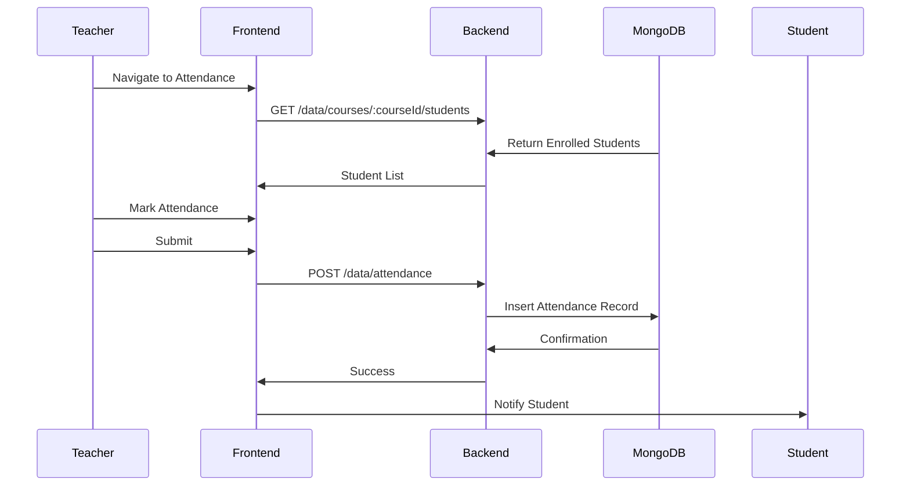

### Fee Payment Flow

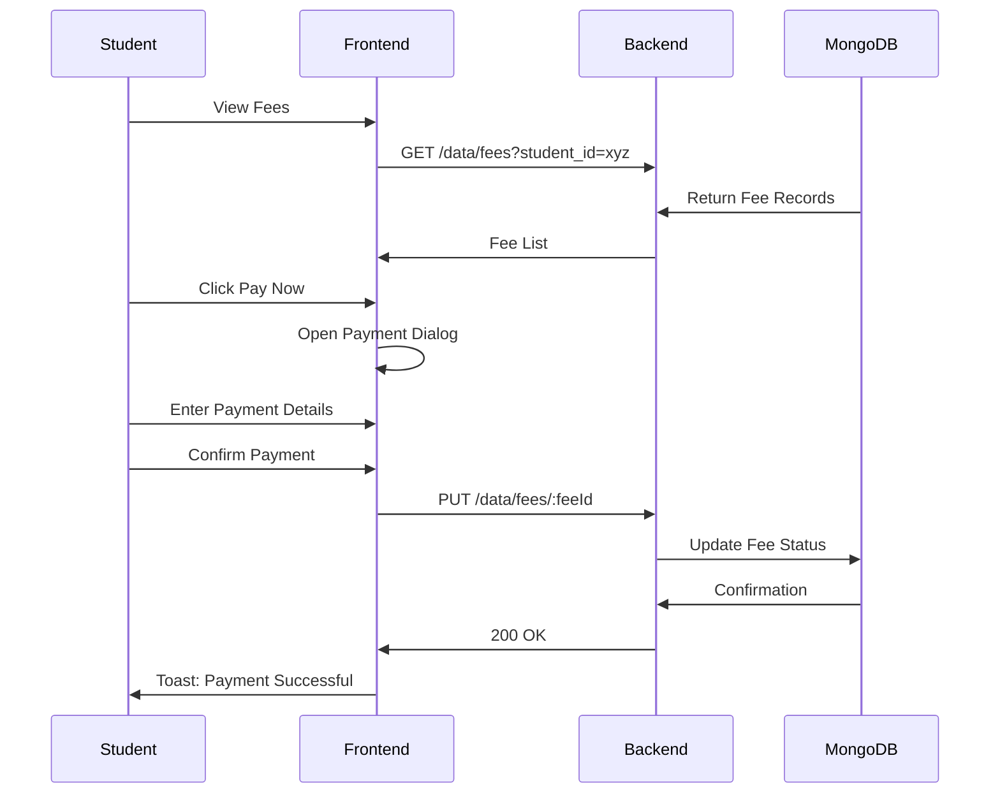

---

## API Routes

### Authentication Routes

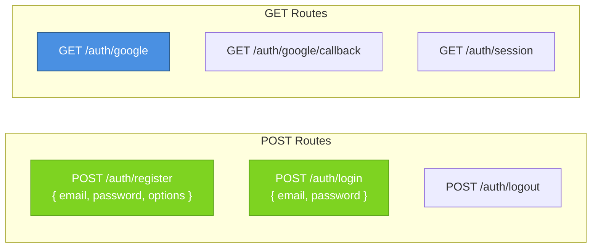

### Data Routes

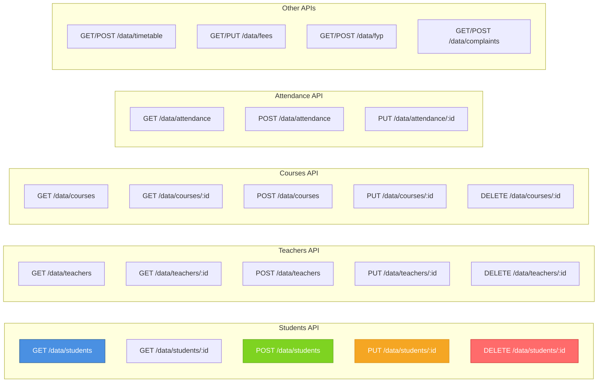

---

## Class Diagrams

### Backend Models

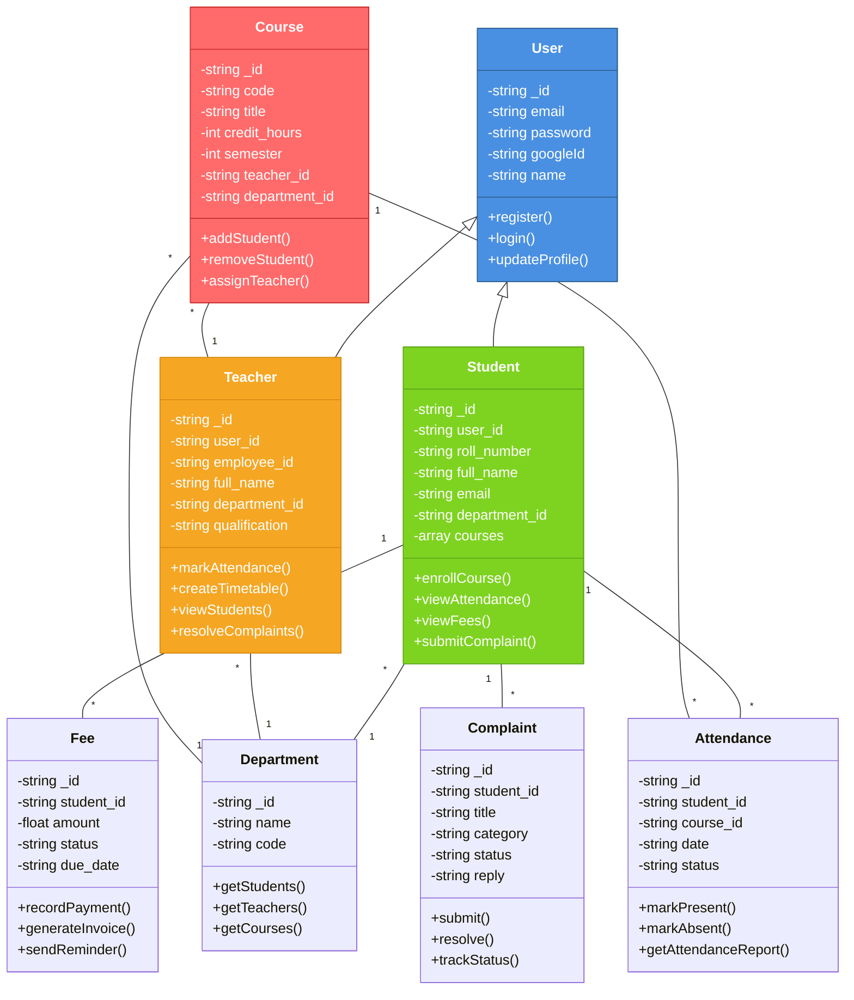

---

## Deployment Architecture

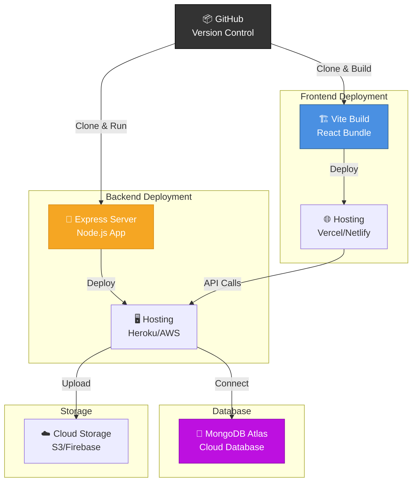

---

## Security Architecture

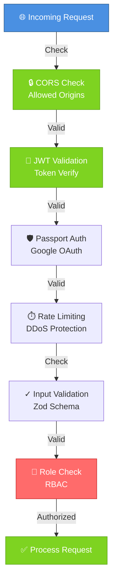

---

## Technology Stack

### Frontend Stack
- **Framework**: React 18+
- **Build Tool**: Vite
- **Language**: TypeScript
- **State Management**: TanStack React Query
- **Routing**: TanStack Router
- **UI Components**: shadcn/ui
- **Styling**: Tailwind CSS
- **Icons**: Lucide React
- **Animations**: Framer Motion
- **Toast**: Sonner

### Backend Stack
- **Runtime**: Node.js
- **Framework**: Express.js
- **Database**: MongoDB with Mongoose
- **Authentication**: Passport.js (Google OAuth), JWT
- **File Upload**: Multer
- **Real-time**: Socket.io
- **Validation**: Zod
- **Logging**: Morgan
- **CORS**: Express CORS

### DevOps & Deployment
- **Version Control**: Git/GitHub
- **Package Manager**: npm
- **Database Hosting**: MongoDB Atlas
- **Server Hosting**: AWS/Heroku
- **Frontend Hosting**: Vercel/Netlify
- **File Storage**: AWS S3/Firebase Storage

---

## Database Indexes

### Recommended MongoDB Indexes

```javascript
// User Collection
db.users.createIndex({ email: 1 }, { unique: true });
db.users.createIndex({ googleId: 1 }, { sparse: true });

// Student Collection
db.students.createIndex({ roll_number: 1 }, { unique: true });
db.students.createIndex({ email: 1 });
db.students.createIndex({ department_id: 1 });
db.students.createIndex({ courses: 1 });

// Teacher Collection
db.teachers.createIndex({ employee_id: 1 }, { unique: true });
db.teachers.createIndex({ department_id: 1 });
db.teachers.createIndex({ email: 1 });

// Course Collection
db.courses.createIndex({ code: 1 });
db.courses.createIndex({ teacher_id: 1 });
db.courses.createIndex({ department_id: 1 });

// Attendance Collection
db.attendance.createIndex({ student_id: 1 });
db.attendance.createIndex({ course_id: 1 });
db.attendance.createIndex({ date: 1 });

// Timetable Collection
db.timetables.createIndex({ day: 1, slot: 1 });
db.timetables.createIndex({ room: 1 });
db.timetables.createIndex({ teacher_id: 1 });

// Fee Collection
db.fees.createIndex({ student_id: 1 });
db.fees.createIndex({ status: 1 });

// Complaint Collection
db.complaints.createIndex({ student_id: 1 });
db.complaints.createIndex({ status: 1 });
```

---

## API Response Formats

### Success Response
```json
{
  "success": true,
  "data": {
    "id": "uuid",
    "name": "Value",
    "createdAt": "2024-01-01T00:00:00Z"
  },
  "message": "Operation successful"
}
```

### Error Response
```json
{
  "success": false,
  "error": {
    "code": "ERROR_CODE",
    "message": "Error description",
    "details": {}
  }
}
```

---

## Authentication Flow

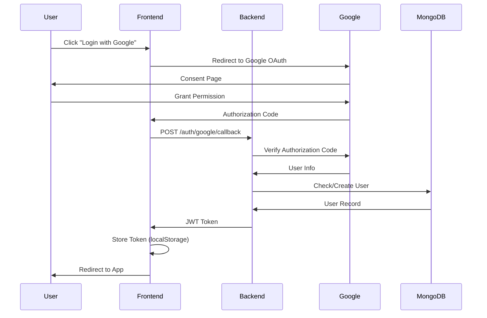

---

## Monitoring & Logging

### Logging Strategy
- **Request Logs**: Morgan middleware for all HTTP requests
- **Error Logs**: Centralized error handling
- **Database Logs**: MongoDB logging
- **Application Logs**: Winston or similar

### Metrics to Monitor
- API response time
- Database query performance
- User authentication events
- File upload statistics
- Real-time connection status
- System resource usage

---

This documentation provides a complete overview of your College Management System architecture, including all components, relationships, and data flows.
